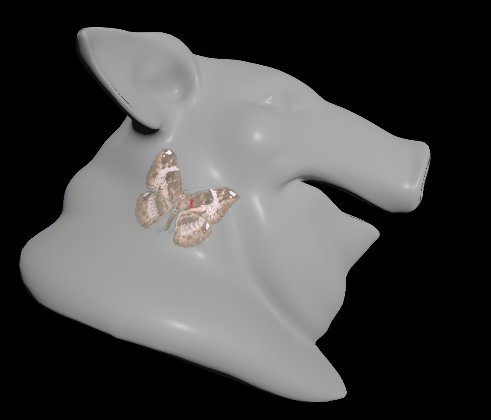

# OUTPUT EXAMPLE

# References
This is a crude implementation of this paper by [Ryan Schmidt](http://www.rms80.com/): [Interactive Decal Compositing with Discrete Exponential Maps](http://www.unknownroad.com/publications/ExpMapSIGGRAPH06.pdf)
