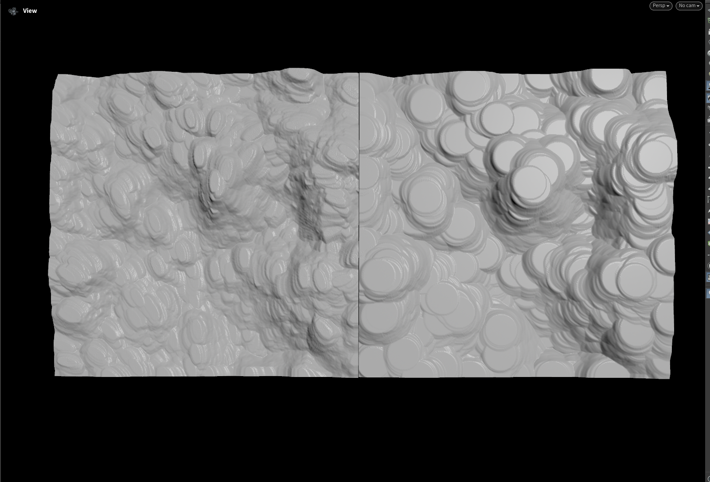

# OUTPUT EXAMPLE
Someone in a discord I belong to asked how to replicate the Aperature tool from Gaea, which i thought was a neat problem. So then I decided why not make it anisotropic too :) 
## Requires H20 for the Opencl Stuff.

