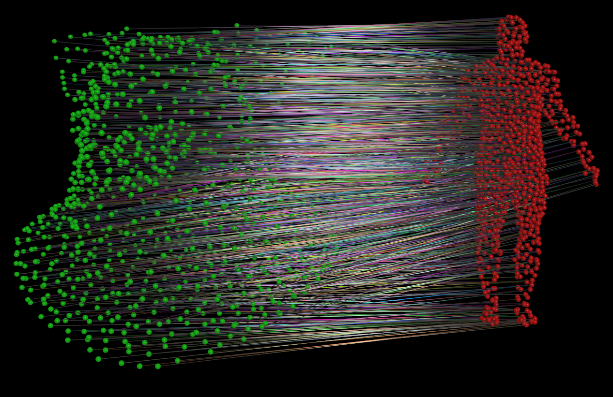

# OpenCL Optimal Transport
This is a Houdini implementation of the Log Domain Sinkhorn method outlined by Gabriel Peyré, in his [numerical tours notebooks](https://nbviewer.org/github/gpeyre/numerical-tours/blob/master/python/optimaltransp_6_entropic_adv.ipynb). I've provided a port of the python version as well as the OpenCL implementation. Should  you use this in production? Probably not, it's unstable, it's slower than it probably could be, and since it only uses 32 bit floats, it's not very robust. I'd recommend looking into CuPy, the Geomloss library or literally any other library for this stuff. I wrote this as a fun challenge to see if it was possible, and sure enough it was. Good luck!

