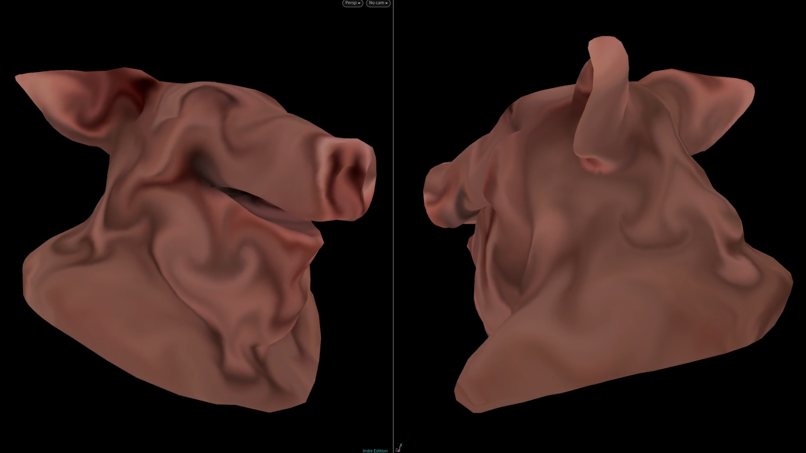

# OUTPUT EXAMPLE
I've always loved the idea of solving fluids on surfaces, because it looks freakin sweet. Which is why I made this demo! The demo includes a couple of small breakdowns as well as a full version of the solver. The crux of this implementation is based off this paper: [Stable, Circulation-Preserving, Simplicial Fluids](http://www.geometry.caltech.edu/pubs/ETKSD07.pdf)

